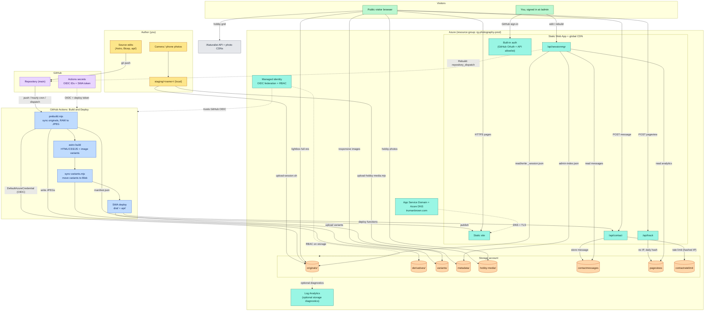
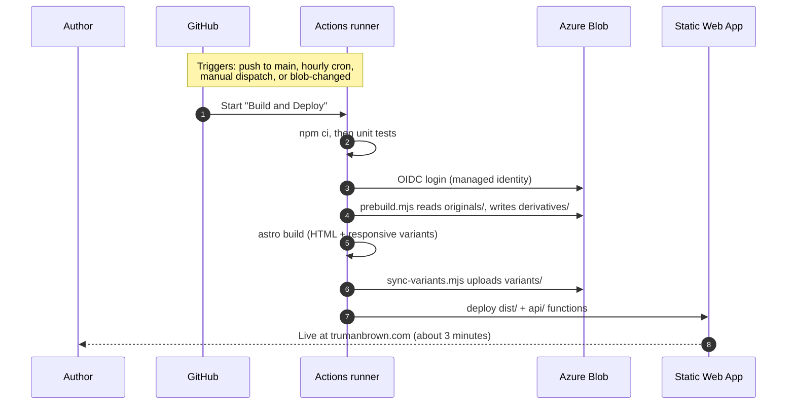

# Architecture: what each piece is and why

> Audience: someone who has built a website before but hasn't necessarily used Azure, Astro, or a CDN. Read this once, then skip to the specific area docs.

## The 30-second version

Photos live in **cloud storage** (Azure Blob). The website is **pre-built into a folder of HTML/CSS/JS** by a tool called **Astro**, then served from a **CDN** (Azure Static Web Apps). When you upload new photos, a **scheduled job on GitHub** notices and rebuilds the site. There is no always-on app server or CMS database; three managed Functions and small Table Storage records handle the dynamic features. Cost is ~$2–3/month.

You drop a folder of photos. The site updates itself.

```
┌────────────────┐                       ┌────────────────┐
│ GitHub repo    │ ──── git push ───────▶│ GitHub Actions │
│ (your code)    │                       │ (build robot)  │
└────────────────┘                       └────────────────┘
                                                 │
                                  reads photos   │   uploads built site
                                                 ▼
                  ┌────────────────────┐    ┌──────────────────────┐
                  │ Azure Blob Storage │    │ Azure Static Web Apps│
                  │ (your photo album) │    │ (CDN that serves it) │
                  └────────────────────┘    └──────────────────────┘
                            ▲                          │
                            │                          │ HTTPS
                            └──────────────┐           │
                              click photo  │           ▼
                              → full-res   │   ┌────────────────┐
                                           └───│ Your visitor's │
                                               │ browser        │
                                               └────────────────┘
```

---

## The complete picture

The 30-second view leaves out the parts that make the site more than static pages: the admin panel, the contact form, analytics, and the interactive hobbies. Here is the whole system and how the pieces talk to each other.



**How to read it.** Color marks each box's role: amber is something you do, purple is GitHub, blue is the build pipeline, teal is Azure compute and identity, orange is Azure storage, green is a visitor, and gray is a third party. Solid arrows carry data; dotted arrows carry control, auth, or telemetry.

Two phases matter, and the split is the key to the whole design:

- **Build time (write path).** Photos and code go in, and the GitHub Actions pipeline turns them into a static site, pushing the heavy images to Blob Storage. None of this runs while a visitor is on the site.
- **Run time (read path).** A visitor's browser loads static HTML from the CDN and talks to three small Azure Functions for the only dynamic bits: recording a pageview, sending a contact message, and (for you, signed in) editing sessions at `/admin`.

### What happens on a build

A push to `main`, the hourly cron, a manual run, or a `blob-changed` dispatch all kick off the same pipeline.



### Components at a glance

| Component | Where it lives | Deep dive |
| --- | --- | --- |
| Photo portfolio (static pages) | `src/pages/`, `src/components/`, built by Astro into `dist/` | this doc |
| Build pipeline | `.github/workflows/build-and-deploy.yml`, `scripts/prebuild.mjs`, `scripts/sync-variants.mjs` | [cicd.md](cicd.md), [image-pipeline.md](image-pipeline.md) |
| Blob containers (`originals`, `derivatives`, `variants`, `metadata`, `hobby-media`) | Azure Storage, defined in `infra/modules/storage.bicep` | [image-pipeline.md](image-pipeline.md) |
| Contact form | `src/components/ContactForm.astro` + `api/contact/` (writes `contactmessages`, throttled via `contactratelimit`) | [security.md](security.md) |
| Analytics | `src/lib/analytics.ts` + `api/track/` (writes `pageviews`) | [analytics.md](analytics.md) |
| Admin panel | `src/pages/admin/`, `src/lib/admin.ts` + `api/sessionmgr/` | [admin.md](admin.md) |
| Interactive hobbies | `src/components/hobbies/`, `src/lib/hobbies/` | [hobbies.md](hobbies.md) |
| Admin auth | SWA built-in auth (GitHub OAuth), `staticwebapp.config.json` | [security.md](security.md) |
| GitHub-to-Azure trust | OIDC federation on a managed identity, `infra/modules/identity.bicep` | [cicd.md](cicd.md) |
| Optional storage diagnostics | Log Analytics, `infra/modules/monitoring.bicep` | [azure.md](azure.md) |
| Domain + DNS | App Service Domain + Azure DNS, `infra/modules/domain.bicep` | [azure.md](azure.md) |

---

## How this differs from a "normal" web server

Three eras of web architecture exist. Knowing where Astro sits explains a lot of the choices in this repo.

### Era 1: Traditional server-rendered (the WordPress / Rails / Django era)

A program (PHP, Ruby, Python) runs on a server. Every time someone visits a page:
1. The server wakes up the program.
2. The program connects to a database.
3. It runs ~10–50 queries to gather data.
4. It builds an HTML string from a template.
5. It sends the HTML back.
6. This repeats for *every visitor on every page load*.

**Pros:** content updates appear instantly (just change the database).
**Cons:** slow per request, lots of moving parts, big attack surface (PHP, MySQL, plugins, the OS, every dependency is a potential security hole), needs a server you keep alive 24/7.

### Era 2: Client-rendered Single-Page App (the early-React era)

The server sends a near-empty HTML shell plus a big JavaScript bundle. The browser:
1. Downloads the bundle (~300 KB+).
2. Parses and runs it.
3. Makes API calls to fetch the actual data.
4. Renders the page in JavaScript.

**Pros:** very dynamic feel after first load.
**Cons:** blank page until JS finishes; bad on mobile/slow connections; SEO/sharing is awkward; you still need the API backend, which has all the era-1 problems.

### Era 3: Static / Jamstack (where Astro sits)

All HTML is pre-built **once, at deploy time**, into a folder of `.html`/`.css`/`.js` files. The server's only job is to serve those files. **No code runs per request.**

When someone visits `/sessions/china-2025`:
- The CDN edge server returns the file `china-2025.html` that already exists on disk.
- That file contains `<picture>` tags pointing at already-optimized image variants.
- The browser parses, downloads images, done.
- No JavaScript is required to display the page.

**Pros:** absurdly fast, nearly free hosting, a small runtime surface (most requests are just files), and trivial scaling for the public pages.
**Cons:** content is as fresh as the last build, no per-visitor personalization.

For a mostly public photo portfolio with one owner-only admin tool, era 3 is a strong fit.

---

## What each piece in this project does

### Astro 5: the website framework

**What it is:** a tool that reads your source code (templates, components, content files) and outputs a folder of static HTML/CSS/JS. That folder is the website. Astro doesn't run when visitors arrive. It ran once, during the build.

**Why Astro specifically:**
- Ships **near-zero JavaScript** by default. Most modern frameworks (Next.js, etc.) send the entire React engine to the browser even when the page is static. Astro sends only what each page actually needs.
- Built-in **image optimization pipeline**: when you reference a photo, Astro generates WebP + JPEG variants at multiple widths and the browser picks the smallest one that fits its screen. You write zero code for this. (AVIF could be enabled too but isn't, to keep build times and stored variants down.)
- **Content collections**: describe your data shape once (sessions with title/date/location), get a type-checked API to read it. Perfect fit for "scan a folder and turn it into pages."

**Alternatives considered:**
- *Hugo*: fast but image pipeline is weaker.
- *Eleventy*: simpler but more DIY.
- *Next.js*: overkill; its best features (SSR, API routes) are useless when you're static.

Full image-pipeline mechanics: [image-pipeline.md](image-pipeline.md).

### Tailwind CSS v3: styling

**What it is:** instead of writing `.card { padding: 16px }`, you compose utility classes inline: `<div class="p-4">`. At build time Tailwind scans your files, keeps only the utilities you actually used, and produces a tiny CSS file.

**Why:**
- Dark mode is one class: `dark:bg-black`. Toggle a `dark` class on `<html>`, every `dark:` rule flips.
- Final CSS is usually under 10 KB after compression.
- No imposed visual style, good for a photo site where chrome should disappear.

### PhotoSwipe v5: the lightbox

**What it is:** ~20 KB JavaScript library giving you the "click photo → fullscreen with swipe / pinch / zoom / keyboard navigation" experience.

**Why this one:** no framework dependency, accessible, touch-friendly. Loaded only on gallery pages, the home page doesn't pay for it.

### Azure Blob Storage: the photo album

**What it is:** Azure's cloud file storage. Think of it as a hard drive in the cloud you access by URL. You upload files, you get back a URL per file.

Terminology:
- **Storage account** = your top-level Azure storage resource (one per project usually).
- **Container** = a top-level "folder" inside a storage account. We use five: `originals/`, `derivatives/`, `variants/`, `metadata/`, and `hobby-media/`.
- **Blob** = a single file inside a container. Each blob has a public URL like `https://stphotographyprod.blob.core.windows.net/originals/china-2025/IMG_4421.jpg`.

**Why split images out of the website's build folder?**
1. Static Web Apps' free tier caps each deploy at 250 MB. Generated variants are moved to Blob so the site stays below it.
2. Git is terrible at binary files. After a few sessions, cloning the repo would be miserable.
3. The whole "drop a folder, site updates itself" promise depends on photos being uploadable without a code change.

Full container layout and access rules: [image-pipeline.md](image-pipeline.md), [security.md](security.md).

### Azure Static Web Apps (SWA): hosting

**What it is:** Azure's managed hosting service for static websites. Free tier gives you:
- 100 GB/month bandwidth.
- A global CDN, copies of your files cached on edge servers around the world, so a visitor in Tokyo doesn't have to fetch from `westus3`.
- Auto-provisioned, auto-renewing HTTPS certificates.
- Free custom domains.
- Free preview environments, every pull request gets its own URL automatically.

**There is no always-on server.** There's nothing to SSH into or keep alive.
SWA serves files from its CDN and invokes the managed Functions on demand.

Full Azure detail: [azure.md](azure.md).

### Azure App Service Domain + Azure DNS: your domain

**App Service Domain:** Azure's built-in domain registrar. It actually buys the `.com` from a partner (currently GoDaddy under the hood) and auto-creates the DNS infrastructure for you.

**Azure DNS:** holds your domain's records (A, CNAME, TXT) and answers DNS queries from visitors' browsers when they ask "what's the IP for `yoursite.com`?"

Why use Azure's registrar? One vendor, one bill, one set of credentials, one Bicep template. Slightly more expensive than the cheapest registrar but saves a layer of integration.

### GitHub Actions: the automation

**What it is:** GitHub's built-in CI/CD service. You write YAML files in `.github/workflows/` describing jobs (steps to run). GitHub runs them on free Linux VMs ("runners"). Triggers include: pushes to a branch, scheduled cron times, manual "Run workflow" button, external webhooks.

**Why we use it (and how) in this project:**
- The **infra workflow** deploys Bicep, only run manually, only when you change infrastructure.
- The **build-and-deploy workflow** rebuilds the site, triggered by pushes (code changes) or by an hourly cron (picks up new photos in Blob without you doing anything).
- The **lint workflow** runs on PRs to catch broken templates before merge.

Full workflow detail with annotated YAML: [cicd.md](cicd.md).

### Bicep: Infrastructure as Code

**What it is:** Microsoft's domain-specific language for describing Azure resources. Instead of clicking around in the Azure portal, you write `.bicep` files declaring what should exist. You run a command (`az deployment ...`), Azure makes reality match the files. Re-running is safe, Azure only changes what's drifted.

**Why this matters:** if you ever want to throw everything away and rebuild fresh (different subscription, different region, new account), it's one command. Without IaC, you'd be re-clicking through dozens of portal pages and inevitably forget something.

**Why Bicep specifically over Terraform / ARM / Docker:**
- *ARM* is raw JSON, painfully verbose. Bicep compiles to ARM, 1/3 the lines.
- *Terraform* is multi-cloud but needs a "state file" stored somewhere. Worth the overhead for AWS+Azure+GCP, not for a one-cloud personal project.
- *Docker + Container Apps* is overkill for static files, you'd pay for an always-on container to serve HTML.

Full Bicep tour: [iac-bicep.md](iac-bicep.md).

---

## Decisions and tradeoffs in one table

| Decision | Why | What was rejected |
|---|---|---|
| Astro (vs. Next.js, Hugo, Eleventy) | Best built-in image pipeline + near-zero JS shipped | Next.js (overkill); Hugo (weaker images); Eleventy (more DIY) |
| Static Web Apps Free (vs. Front Door, App Service, Container Apps) | Free, includes CDN + TLS + previews | Front Door (~$35/mo base); App Service (overkill); Container Apps (not needed) |
| Blob Storage (vs. images in git) | No 500 MB deploy cap; no git bloat; uploads don't need a code change | Git LFS (works but defeats the "drop a folder" workflow) |
| Bicep (vs. Terraform, ARM, Pulumi) | One cloud, no state file, native Azure tooling | Terraform (state-file overhead); ARM (too verbose); Pulumi (extra runtime) |
| OIDC federation (vs. service principal secrets) | No long-lived secrets in GitHub; rotation is automatic | Service principal with `client_secret` (works but leaks if exposed) |
| Hourly cron rebuild (vs. Event Grid → webhook) | Simple, free, "good enough" for personal portfolio | Event Grid + Azure Function (works but adds parts; trigger already wired for future) |
| No WAF / Front Door | Bounded Functions use throttling and allowlisted auth; a ~$35/mo edge tier is disproportionate at personal traffic | WAF would cost more than everything else combined |

---

## What's not here (and why)

- **No relational or CMS database.** Session metadata is JSON in Blob; small operational records (messages, rate limits, analytics) use Azure Table Storage.
- **No always-on application server.** SWA serves files from a CDN and invokes three managed Functions only when requested.
- **No custom account system.** Visitors are public; the owner-only admin uses SWA GitHub OAuth plus a server-side username allowlist.
- **No third-party analytics SDK.** A small first-party beacon writes bounded, cookieless records to Table Storage.

See [docs/azure.md](azure.md#future-extensibility) for what to preserve so admin upload and iCloud sync can land later without rework.
